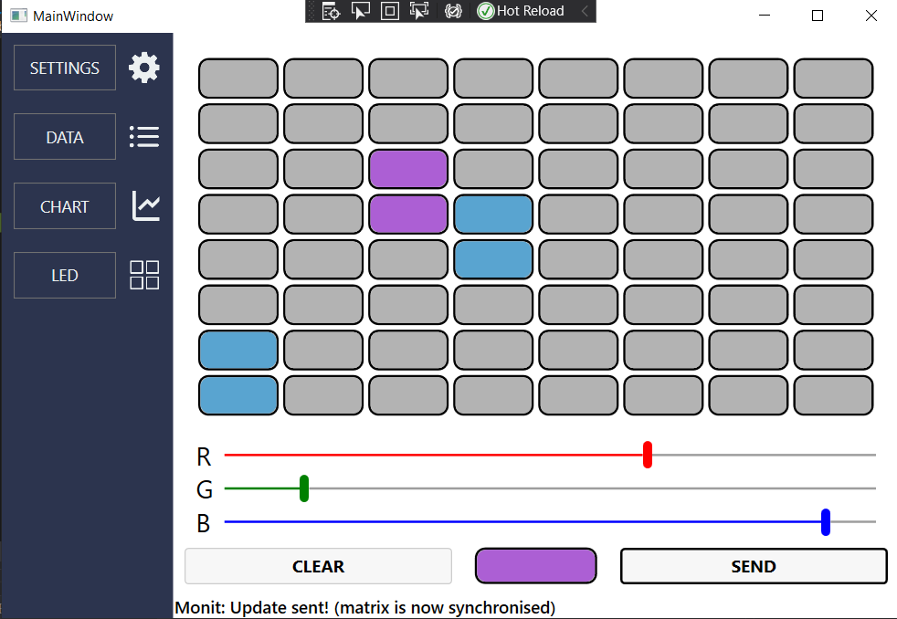

#### ABOUT

Desktop application for the IoT system project. Designed in MVVM archtecture paradigm.

#### MODULES
 1. __Settings__: enables setting IP address for connection and chart visualization parameters (e.g. sample size).
 2. __Data List__: by clikcing a button it obtains data from the server and displays it in a list form.
 3. __Chart__: enables choosing a particular type of data to be periodically displayed on a chart.
 4. __LED Matrix Control__: enables setting a chosen color on a LED matrix and send the settings to the LED matrix of the server.

  

    
  

  

    
  

  

    
  

  

    
  

#### RESULTS

  
  